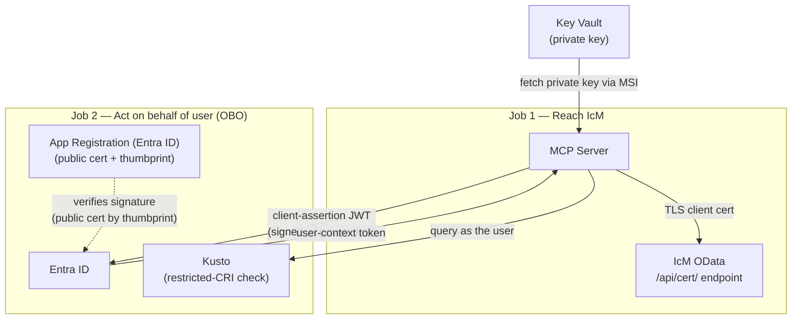
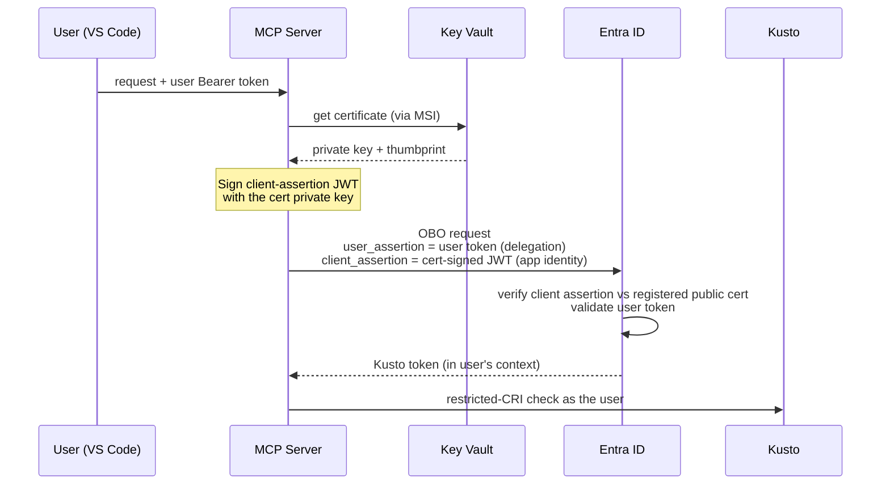

# Onboarding Diagrams

Companion diagrams for [new-team-onboarding-script.md](new-team-onboarding-script.md).

---

## ICM Certificate — one cert, two jobs

---

## OBO token exchange — who proves what

---
