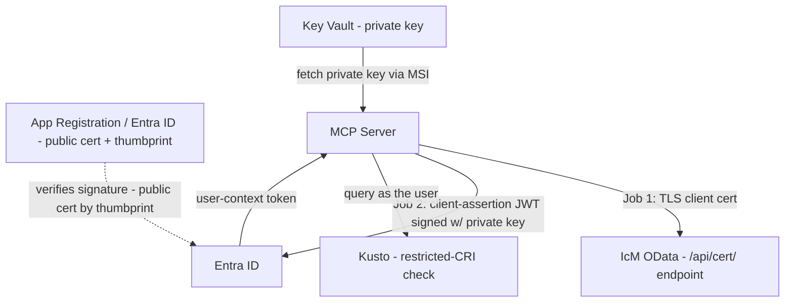

# Onboarding Diagrams

Companion diagrams for [new-team-onboarding-script.md](new-team-onboarding-script.md).

---

## ICM Certificate — one cert, two jobs



---

## OBO token exchange — who proves what

```mermaid
sequenceDiagram
    participant U as User VS Code
    participant M as MCP Server
    participant KV as Key Vault
    participant E as Entra ID
    participant K as Kusto

    U->>M: request + user Bearer token
    M->>KV: get certificate via MSI
    KV-->>M: private key + thumbprint
    Note over M: Sign client-assertion JWT with the cert private key
    M->>E: OBO request - user_assertion (delegation) + client_assertion (app identity)
    E->>E: verify client assertion vs registered public cert; validate user token
    E-->>M: Kusto token in user context
    M->>K: restricted-CRI check as the user
```

---
