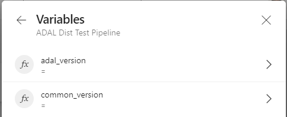

# How to run Automation during releases

## Related Readings

- [Testing Overview](./testing_overview.md)

- [Lab Setup](./labsetup.md)

- [Gradle Project Properties as Command Line Arguments](../ProjectBuild/gradle_project_properties.md)

- [How to run Android Tests](./how_to_run_tests.md)

## Introduction

The Android Client team maintains multiple libraries such as the MSAL library as well as the Broker library, and therefore maintains test plans that need to be executed as part of doing the release to ensure we don't regress our code. 

We've written automated tests that can be run to validate our code prior to doing these releases. This automation can be run at any time, however, this document primarily focuses on how to run it properly at the time of doing the release. We've written scripts as well as created pipelines that facilitate running the automation during releases, we will go over it below.

## MSAL Release

We can run MSAL automation during releases both locally as well

### Locally

Run the [MSAL Release Automation Script](../../MsalReleaseAutomation.ps1) located in Android-Complete project. 

The script can be run as follows:

`.\MsalReleaseAutomation.ps1 -msalVersion <msal-version> -labSecret <secret-value>`

The script takes two arguments as follows:

- **msalVersion** - this is msal version number (typically an RC build) that we are trying to test
- **labSecret** - the secret required to use LAB API. More details here: [LabSetup.md](labsetup.md)

### Pipelines

- Run the [Azure Sample PROD App Pipeline](https://dev.azure.com/IdentityDivision/IDDP/_build?definitionId=1278) by supplying the `distMsalVersion` in the pipeline variables

- Wait for the above pipeline to finish, then move on to next step

- Run the [MSAL Release Test Pipeline](https://dev.azure.com/IdentityDivision/IDDP/_build?definitionId=1283) and supply the `msal_version` in the pipeline variables
  
  

## Broker Release

We can run Broker automation during releases both locally as well

### Locally

Run the [Broker Release Automation Script](../../BrokerReleaseAutomation.ps1) located in Android-Complete project. 

The script can be run as follows:

`.\BrokerReleaseAutomation.ps1 -labSecret <secret-value> -authenticatorApkPath '<path-to-apk>' -companyPortalApkPath '<path-to-apk>'`

The script takes two arguments as follows:

- **labSecret** - the secret required to use LAB API. More details here: [LabSetup.md](labsetup.md)
- **authenticatorApkPath** - the path to Authenticator APK pointing to broker version (typically an RC build) that we are trying to test
- **companyPortalApkPath** - the path to Company Portal APK pointing to broker version (typically an RC build) that we are trying to test

### Pipelines

- Run the [Azure Sample PROD App Pipeline](https://dev.azure.com/IdentityDivision/IDDP/_build?definitionId=1278) by supplying the `distMsalVersion` in the pipeline variables

- Wait for the above pipeline to finish, then move on to next step

- Run the [Broker Release Test Pipeline](https://identitydivision.visualstudio.com/Engineering/_build?definitionId=1490) and supply
  * `msal_branch` and `broker_branch` in the pipeline variables
  * [Company Portal RC Link](https://install.appcenter.ms/orgs/Intune-Windroid/apps/Intune-Android-Company-Portal-Broker) and [Authenticator RC Link](https://install.appcenter.ms/orgs/authapp-t7qc/apps/Microsoft-Authenticator-Android-Broker) in the pipeline arguments

## ADAL with Common Release

Run the following pipeline by supplying the version of common that you want to test: https://dev.azure.com/IdentityDivision/IDDP/_build?definitionId=1288

